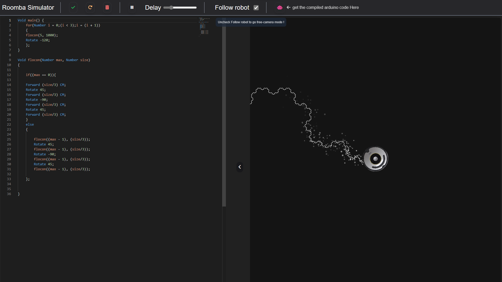

# ASE Project - Robot DSL project

Try out the simulator ! : https://robot.ronantremoureux.fr

In this project, we created a DSL.
This DSL is here to help with creating programs controlling robots.
The use of a external DSL here is very powerfull, as it allows to create a language that is very close to the problem domain.

First we developped a model thanks to Eclipse Ecore and Xtext.
We then migrate the grammar outputed by Xtext to langium.

This repository holds the complete code of the langium project. It contains a **compiler**, an **interpretor**, a **web simulator** and a vscode extension.

This readme will explain how to use the different parts of the project, and the problems encountered during developpement.


# How to use

## Running in the editor

### Install the extension

1. Clone the repository

2. run `npm install` in the root folder

3. run `sh buildAll.sh` script to build the editor and web engine. It will also open the development instance of vscode.

4. run `sh interpret` will interpret the code present in the test project at the root of this repository

5. run `sh compile` to try the compiler 

6. run `npm run serve` after building to open the web server and try the web simulator at ```localhost:3000```.

## modify the test project

at the root find the myRobotProject folder, it contains the test project.

Inside there is a main file, and a folder with the grammar files.

When opening the new vscode instance, open the folder myRobotProject and you are ready to go.

## Running in the web



The web simulator is oppening on ```localhost:3000``` after running the command ```npm run serve``` after building the project. (the latest verison is also avialable at https://robot.ronantremoureux.fr)

The web simulator is a simple web page that allows to write code in the editor, and see the result of the execution of the code in the simulator. You have some controll on the simulation such as follow the robot, pause the simulation, or change the speed of the simulation.

The web simulator includes also some type checking features and error reporting.

## problems encountered during developpement

### Ecore modeling

We used eclipse as our modeling tool. The problem we encountered in this part was to deal with eclipse crash and bugs. As we were modeling our language, we had some wiered disapearing of some class in the ecore model.

### Languium

Languium is a very powerfull framework as we saw during developpement. Therfore, we had issue with the documentation. As the practical session started just before a new version of langium was released, we had to deal with some changes in the framework that were not documented.

### The weavers

The concept of weaver was not very clear initally. It is used to re-create the open class principle lacking in javascript. We had to understand how to use it, and how to integrate it in the languium project.

### Web simulator

We had to understand what to do with the web simulator. As the languim version had changed, we were not able to follow the tutorial given. So we had to adapt the for the new version of langium. Un exemple concret serait la manière de charger en backend un document donné par URI.


